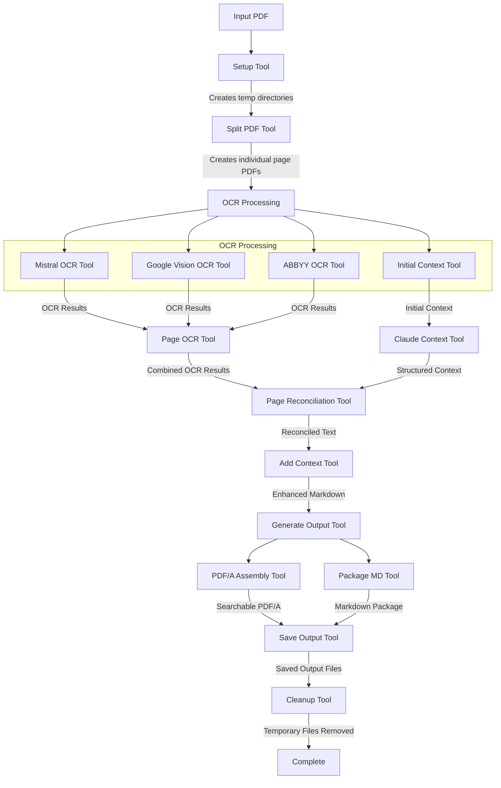

# OCR PDF

A powerful PDF OCR tool built with Flowlite that extracts text from PDF documents using multiple AI-powered OCR engines, reconciles the results for maximum accuracy, and outputs both a searchable PDF and structured Markdown file.

## Features

- **Multi-Engine OCR**: Uses multiple AI-powered OCR engines for superior results:
  - Mistral AI Vision (primary OCR engine)
  - Google Cloud Vision (optional, requires API key)
  - ABBYY Cloud OCR (optional, requires API key and application ID)
- **AI-Powered Context Extraction**: Uses Claude 3.7 to extract structured context from OCR text
- **AI-Powered Reconciliation**: Uses Claude to reconcile results from all available OCR engines
- **Structured Content Extraction**: Identifies document structure (headings, paragraphs, lists, tables)
- **Multiple Output Formats**:
  - Searchable PDF/A with embedded text
  - Structured Markdown with preserved document formatting
- **Secure Credential Management**: Safely stores API keys in your system keychain
- **Interactive CLI**: Prompts for missing parameters and credentials
- **Modular Architecture**: Each tool is implemented as a separate, testable module
- **State Accumulation Model**: Tools return only new state properties to be merged with existing state

## Project Structure

The project follows a modular architecture with individual tools:

```
ocr-pdf/
├── tools/                       # Individual tool implementations
│   ├── 01-setup.tool.js            # Creates temporary directories
│   ├── 02-split-pdf.tool.js        # Splits PDF into individual pages
│   ├── 03-mistral-ocr.tool.js      # Extracts text using Mistral AI Vision
│   ├── 03a-google-vision-ocr.tool.js # Extracts text using Google Cloud Vision
│   ├── 03b-abbyy-ocr.tool.js       # Extracts text using ABBYY Cloud OCR
│   ├── 03c-initial-context.tool.js # Extracts initial context using Claude
│   ├── 04-page-ocr.tool.js         # Processes pages with multiple OCR engines
│   ├── 04-claude-context.tool.js   # Extracts structured context using Claude
│   ├── 05-page-reconciliation.tool.js # Reconciles OCR results using Claude
│   ├── 06-add-context.tool.js      # Enhances markdown with semantic context tags
│   ├── 06-generate-output.tool.js  # Generates output files
│   ├── 07-pdfa-assembly.tool.js    # Creates a PDF/A-3 compliant document
│   ├── 07-cleanup.tool.js          # Removes temporary files and directories
│   ├── 08-package-md.tool.js       # Packages markdown content into a ZIP archive
│   ├── 08-process-pages.tool.js    # Processes all pages in parallel
│   ├── 09-save-output.tool.js      # Saves output files to S3 or local storage
│   └── 10-cleanup.tool.js          # Final cleanup of all temporary resources
├── tests/                       # Test files for each tool
│   ├── 01-setup.tool.test.js
│   ├── 02-split-pdf.tool.test.js
│   ├── 03-mistral-ocr.tool.test.js
│   ├── 03a-google-vision-ocr.tool.test.js
│   ├── 03b-abbyy-ocr.tool.test.js
│   ├── 03c-initial-context.tool.test.js
│   ├── 04-page-ocr.tool.test.js
│   ├── 04-claude-context.tool.test.js
│   └── 07-cleanup.tool.test.js
├── ocr-pdf.flow.js              # Main flow that combines all tools
└── index.js                     # CLI interface
```

## State Accumulation Model

The OCR-PDF application uses a state accumulation model, where:

1. Each tool receives a single `state` object as input
2. Tools extract only the properties they need from the state
3. Tools return only the new properties to be added to the state
4. The flow merges the tool result with the existing state
5. Each tool includes a completion flag (e.g., `setupComplete`, `ocrComplete`)

This approach ensures:
- Clean state management with minimal boilerplate
- Clear separation of concerns between tools
- Efficient passing of only necessary data
- Ability to track the progress of each tool

## Processing Flow

The OCR-PDF application follows this sequence of operations:



## How Each Stage Works

### 1. Setup Tool (`01-setup.tool.js`)
- **Purpose**: Creates temporary directories for processing
- **Input**: Input PDF path
- **Output**: Temporary directory structure
- **State Flag**: `setupComplete`
- **File Handling**: Creates directories for raw pages, OCR results, and output files

### 2. Split PDF Tool (`02-split-pdf.tool.js`)
- **Purpose**: Splits the input PDF into individual page PDFs
- **Input**: Input PDF path, temporary directories
- **Output**: Array of page file objects with paths to individual PDF pages
- **State Flag**: `splitComplete`
- **File Handling**: Saves each page as a separate PDF file in the raw pages directory

### 3. OCR Processing (Multiple Tools)

#### 3.1 Mistral OCR Tool (`03-mistral-ocr.tool.js`)
- **Purpose**: Extracts text from PDF pages using Mistral AI Vision
- **Input**: Page files, temporary directories
- **Output**: OCR results with text content and paths to result files
- **State Flag**: `ocrComplete`
- **File Handling**: Saves OCR text and JSON results to files

#### 3.2 Google Vision OCR Tool (`03a-google-vision-ocr.tool.js`)
- **Purpose**: Extracts text from PDF pages using Google Cloud Vision
- **Input**: Page files, temporary directories
- **Output**: OCR results with text content and paths to result files
- **State Flag**: `googleVisionComplete`
- **File Handling**: Saves OCR text and JSON results to files

#### 3.3 ABBYY OCR Tool (`03b-abbyy-ocr.tool.js`)
- **Purpose**: Extracts text from PDF pages using ABBYY Cloud OCR
- **Input**: Page files, temporary directories
- **Output**: OCR results with text content and paths to result files
- **State Flag**: `abbyyComplete`
- **File Handling**: Saves OCR text and XML results to files

#### 3.4 Initial Context Tool (`03c-initial-context.tool.js`)
- **Purpose**: Extracts initial context from first pages using Claude
- **Input**: Page files, temporary directories
- **Output**: Initial context information about the document
- **State Flag**: `initialContextComplete`
- **File Handling**: Saves combined text and context JSON to files

### 4. Page OCR Tool (`04-page-ocr.tool.js`)
- **Purpose**: Processes pages with multiple OCR engines in parallel
- **Input**: Page files, temporary directories
- **Output**: Combined OCR results from all engines
- **State Flag**: `pageOcrComplete`
- **File Handling**: Organizes OCR results by page and engine, generates initial markdown

### 5. Claude Context Tool (`04-claude-context.tool.js`)
- **Purpose**: Extracts structured context from OCR text using Claude 3.7
- **Input**: OCR results, temporary directories
- **Output**: Structured context information
- **State Flag**: `contextComplete`
- **File Handling**: Saves structured context as JSON files

### 6. Page Reconciliation Tool (`05-page-reconciliation.tool.js`)
- **Purpose**: Reconciles OCR results from different engines using Claude
- **Input**: OCR results from all engines, structured context
- **Output**: Reconciled text for each page
- **State Flag**: `reconciliationComplete`
- **File Handling**: Saves reconciled text to files

### 7. Add Context Tool (`06-add-context.tool.js`)
- **Purpose**: Enhances markdown with semantic context tags
- **Input**: Reconciled text, structured context
- **Output**: Enhanced markdown with semantic tags
- **State Flag**: `contextAddedComplete`
- **File Handling**: Saves enhanced markdown to files

### 8. Generate Output Tool (`06-generate-output.tool.js`)
- **Purpose**: Generates output files (PDF and Markdown)
- **Input**: Enhanced markdown, reconciled text
- **Output**: Paths to generated output files
- **State Flag**: `outputGeneratedComplete`
- **File Handling**: Creates initial output files

### 9. PDF/A Assembly Tool (`07-pdfa-assembly.tool.js`)
- **Purpose**: Creates a PDF/A-3 compliant document
- **Input**: Generated output files
- **Output**: Path to PDF/A document
- **State Flag**: `pdfaComplete`
- **File Handling**: Creates PDF/A document with embedded text

### 10. Package MD Tool (`08-package-md.tool.js`)
- **Purpose**: Packages markdown content into a ZIP archive
- **Input**: Enhanced markdown files
- **Output**: Path to markdown package
- **State Flag**: `packageComplete`
- **File Handling**: Creates ZIP archive with markdown files

### 11. Save Output Tool (`09-save-output.tool.js`)
- **Purpose**: Saves output files to S3 or local storage
- **Input**: PDF/A document, markdown package
- **Output**: URLs or paths to saved files
- **State Flag**: `saveComplete`
- **File Handling**: Copies files to final destination

### 12. Cleanup Tool (`07-cleanup.tool.js` or `10-cleanup.tool.js`)
- **Purpose**: Removes temporary files and directories
- **Input**: Temporary directories
- **Output**: Success status
- **State Flag**: `cleanupComplete`
- **File Handling**: Deletes temporary files and directories

## File Handling Strategy

The OCR-PDF application processes book-sized PDFs efficiently by:

1. **Storing Data on Disk**:
   - Large file data (PDFs, images, OCR results) is stored on disk
   - Only file paths and metadata are passed in the state object
   - This keeps the state object small and efficient

2. **Organized Directory Structure**:
   ```
   temp/
   ├── raw_pages/            # Individual PDF pages
   │   ├── page_1.pdf
   │   ├── page_2.pdf
   │   └── ...
   ├── ocr_results/          # OCR results by page and engine
   │   ├── page_1/
   │   │   ├── mistral/
   │   │   │   ├── text.txt  # Extracted text
   │   │   │   └── result.json # Full API response
   │   │   ├── google/
   │   │   │   ├── text.txt
   │   │   │   └── result.json
   │   │   ├── abbyy/
   │   │   │   ├── text.txt
   │   │   │   └── result.xml
   │   │   └── md/          # Markdown versions
   │   │       ├── mistral.md
   │   │       ├── google.md
   │   │       └── abbyy.md
   │   └── ...
   ├── json_results/         # Structured JSON results
   │   ├── initial_context/
   │   │   ├── combined_text.txt
   │   │   └── initial_context.json
   │   └── ...
   └── output/               # Final output files
       ├── pdf/
       │   └── output.pdf
       └── md/
           └── output.md
   ```

3. **Parallel Processing**:
   - Each page is processed independently
   - Multiple OCR engines run in parallel
   - Results are combined and reconciled after processing

## Installation

```bash
npm install
```

## Usage

```bash
node index.js <input-pdf> <output-pdf> [options]
```

### Options

- `-h, --help`: Show help information
- `-v, --version`: Show version number
- `--force-secrets`: Force prompt for API keys, even if they exist
- `--gen-env`: Generate .env-example file

### Examples

```bash
node index.js ./document.pdf ./document-ocr.pdf
node index.js ./document.pdf ./document-ocr.pdf --force-secrets
```

## Required API Keys

- **MISTRAL_API_KEY**: Required for Mistral AI Vision OCR
- **ANTHROPIC_API_KEY**: Required for Claude context extraction and reconciliation
- **GOOGLE_CLOUD_VISION_KEY**: Optional for Google Vision OCR
- **ABBYY_API_KEY**: Optional for ABBYY Cloud OCR
- **ABBYY_APPLICATION_ID**: Optional for ABBYY Cloud OCR

API keys can be provided in any of the following ways:
1. Environment variables
2. .env file
3. System keychain
4. Interactive prompt

## Output Files

For each processed PDF, the app generates two output files:

1. **Searchable PDF/A**: A PDF with embedded text that can be searched, copied, and indexed
2. **Structured Markdown**: A Markdown file that preserves the document structure including:
   - Document title
   - Headings
   - Paragraphs
   - Lists (both bulleted and numbered)
   - Tables
   - Metadata (author, date, etc.)

## Development Approach

The project follows a test-driven development approach:

1. Each tool is developed in its own file in the `/tools` directory with a numbered prefix (e.g., `01-toolname.tool.js`)
2. Each tool has a corresponding test file in the `/tests` directory with the same numbered prefix
3. Tools are developed, tested, and refactored individually
4. Once a tool is complete, it is integrated into the main flow file
5. This approach ensures high-quality, well-tested components

## Testing

The application includes comprehensive tests for each tool:

```bash
npm test
```

Individual tools can be tested with:

```bash
npm test -- -t "Tool Name"
